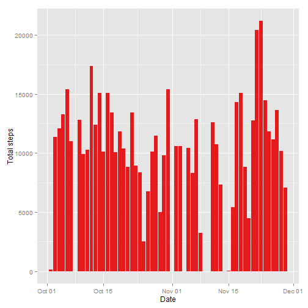
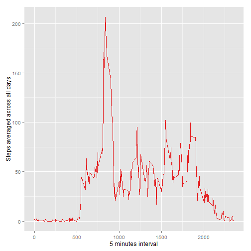
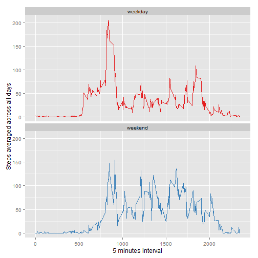

## Loading and preprocessing the data
Creating  `AMD` dataset from the unzipped *activity.csv* file:


```r
unzip(zipfile = "activity.zip")
AMD <- read.csv(file="activity.csv")
```

`date` variable is tranformed in Date format and some summaries are printed


```r
AMD$date <- as.Date.factor(x = AMD$date)
str(AMD)
```

```
## 'data.frame':	17568 obs. of  3 variables:
##  $ steps   : int  NA NA NA NA NA NA NA NA NA NA ...
##  $ date    : Date, format: "2012-10-01" "2012-10-01" ...
##  $ interval: int  0 5 10 15 20 25 30 35 40 45 ...
```

```r
summary(AMD)
```

```
##      steps             date               interval     
##  Min.   :  0.00   Min.   :2012-10-01   Min.   :   0.0  
##  1st Qu.:  0.00   1st Qu.:2012-10-16   1st Qu.: 588.8  
##  Median :  0.00   Median :2012-10-31   Median :1177.5  
##  Mean   : 37.38   Mean   :2012-10-31   Mean   :1177.5  
##  3rd Qu.: 12.00   3rd Qu.:2012-11-15   3rd Qu.:1766.2  
##  Max.   :806.00   Max.   :2012-11-30   Max.   :2355.0  
##  NA's   :2304
```

## What is mean total number of steps taken per day?

Loading needed packages

```r
library(dplyr)
library(ggplot2)
library(RColorBrewer)
```

#### 1. Make a histogram of the total number of steps taken each day

For this plot `ggplot2` is used 

```r
g <- ggplot(AMD, aes(x=date,y=steps))
g + geom_histogram(stat="identity", fill = brewer.pal(3,"Set1")[1]) + ylab("Total steps") + xlab("Date")
```

 

#### 2. Calculate and report the **mean** and **median** total number of steps taken per day

Creating `AMD_Steps` dataset summarizing `AMD` by `date` and calculating the total number of steps per day:

```r
AMD_Steps <- summarise(group_by(AMD, date), totSteps = sum(steps))
```
And then **mean** and **median** are:

```r
mean(AMD_Steps$totSteps,na.rm = T)
```

[1] 10766.19

```r
median(AMD_Steps$totSteps,na.rm = T)
```

[1] 10765

## What is the average daily activity pattern?

#### 1. Time series plot of the 5-minute interval and the average number of steps taken, averaged across all days.

Creating `AMD_Steps_mins` dataset summarizing `AMD` by `interval` and calculating the mean of steps per interval:

```r
AMD_Steps_mins <- summarise(group_by(AMD, interval), avgSteps = mean(steps,na.rm=T))

g <- ggplot(AMD_Steps_mins, aes(x=interval, y=avgSteps)) 
g + geom_line(colour=brewer.pal(n = 3,name = "Set1")[1]) + ylab("Steps averaged across all days") + xlab("5 minutes interval") 
```

 

#### 2. Which 5-minute interval, on average across all the days in the dataset, contains the maximum number of steps?

```r
AMD_Steps_mins[which.max(x = AMD_Steps_mins$avgSteps),]
```

```
## Source: local data frame [1 x 2]
## 
##   interval avgSteps
## 1      835 206.1698
```


## Imputing missing values

#### 1. Calculate and report the total number of missing values in the dataset

```r
sum(is.na(AMD$steps))
```

```
## [1] 2304
```

#### 2. Devise a strategy for filling in all of the missing values in the dataset.
The strategy for filling missing values will be to change the `NAs` with the median number of steps for that 5-minutes interval.  
#### 3. Create a new dataset that is equal to the original dataset but with the missing data filled in
To create the new dataset without missing values, the dataset `AMD_Steps_median` has been created with the median value of steps per each 5-minutes interval. Then `AMD`  and `AMD_Steps_median` are merged by `interval` in the `AMD_Steps_NA` dataset

```r
AMD_Steps_median <- summarise(group_by(AMD, interval), medianSteps = median(steps,na.rm=T))
AMD_Steps_NA <- arrange(merge(AMD,AMD_Steps_median,by="interval",all.x=T),date,interval)
```

Then the `AMD_fill` dataset is created by filling the missing valuesin `AMD` with a `for` loop

```r
AMD_fill <- AMD
for(i in 1:NROW(AMD_fill)) {
        AMD_fill[i,"steps"] <- ifelse(is.na(AMD_fill[i,"steps"]),AMD_Steps_NA[i,"medianSteps"],AMD_fill[i,"steps"])
}
```

#### 4. Make a histogram of the total number of steps taken each day. 

```r
g <- ggplot(AMD_fill, aes(x=date,y=steps))
g + geom_histogram(stat="identity", fill = brewer.pal(3,"Set1")[1]) + ylab("Total steps") + xlab("Date")
```

 

#### Calculate and report the **mean** and **median** total number of steps taken per day.

The `AMD_Steps_fill` dataset is created summarizing `AMD_fill` by `date` and calculating the total number of steps per day. Then **mean** and **median** are calculated:

```r
AMD_Steps_fill <- summarise(group_by(AMD_fill, date), totSteps = sum(steps))
mean(AMD_Steps_fill$totSteps,na.rm = T)
```

```
## [1] 9503.869
```

```r
median(AMD_Steps_fill$totSteps,na.rm = T)
```

```
## [1] 10395
```
#### Do these values differ from the estimates from the first part of the assignment?

Difference in mean and median are

```r
mean(AMD_Steps$totSteps,na.rm = T) - mean(AMD_Steps_fill$totSteps,na.rm = T)
```

```
## [1] 1262.32
```

```r
median(AMD_Steps$totSteps,na.rm = T) - median(AMD_Steps_fill$totSteps,na.rm = T)
```

```
## [1] 370
```

## Are there differences in activity patterns between weekdays and weekends?

#### 1. Create a new factor variable in the dataset with two levels -- "weekday" and "weekend" indicating whether a given date is a weekday or weekend day.
Create `day` factor variable with values `weekday,weekend` after setting English day names.

```r
Sys.setlocale("LC_TIME", "English")
AMD_fill$day <- weekdays(x = AMD_fill$date)
AMD_fill$day <- factor(AMD_fill$day,levels = unique(AMD_fill$day),labels = c(rep("weekday",5),rep("weekend",2)))
AMD_fill$day <- factor(AMD_fill$day)
```

#### 2. Make a time series plot of the 5-minute interval and the average number of steps taken, averaged across all weekday days or weekend days.

Using the `AMD_Steps_mins_fill` dataset that summarizes `AMD_fill` and calculating the mean of steps per `interval` and `day`:

```r
AMD_Steps_mins_fill <- summarise(group_by(AMD_fill, interval, day), avgSteps = mean(steps,na.rm=T))
g <- ggplot(AMD_Steps_mins_fill, aes(x=interval, y=avgSteps,colour = day)) 
g + facet_wrap( ~ day,nrow = 2) + geom_line() + ylab("Steps averaged across all days") + xlab("5 minutes interval") + scale_color_brewer(palette = "Set1") + theme(legend.position="none")
```

 
